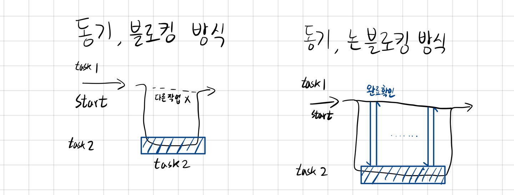
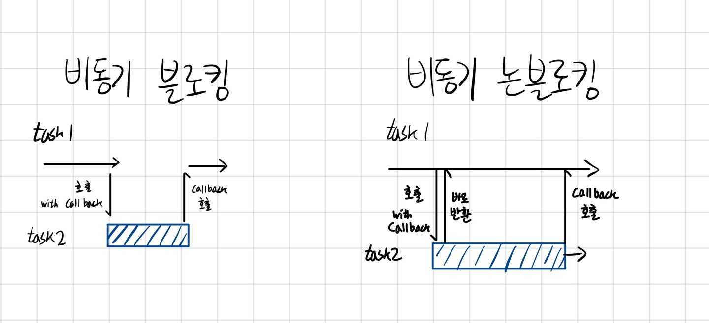
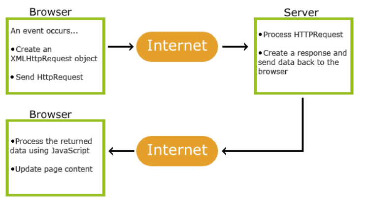

## 동기 비동기
### 동기(Asynchronous)
- 직렬적으로 태스크를 수행하는 방식
- 요청을 보내고 응답을 받아 하나의 태스크가 끝날 때 까지 기다렸다가 다음 태스크가 실행

### 비동기(Synchronous)
- 한번에 여러 태스크가 동시에 병렬적으로 실행
- 예. Web API, Ajax, setTimeout

## AJAX(Asynchronous Javascript And Xml)
- 뒤에서 웹 서버와 데이터를 교환하여 웹페이지를 비동기적으로 일부를 업데이트 할 수 있다.

### AJAX 작동 방식

1. 웹페이지에서 이벤트 발생
2. XMLHttpRequest 객체가 js에 의해 생성
3. XMLHttpRequest 객체는 웹 서버에 요청을 보낸다.
4. 서버가 요청을 처리하여 응답
5. js로 응답을 읽어 페이지 일부 업데이트

## ``🤔궁금한 점``
- fetch, axios, ajax는 다 같은 통신인데 뭐가 다르지?
- fetch
- axios
- ajax

## CORS(Cross-Origins-Resource-Security)

