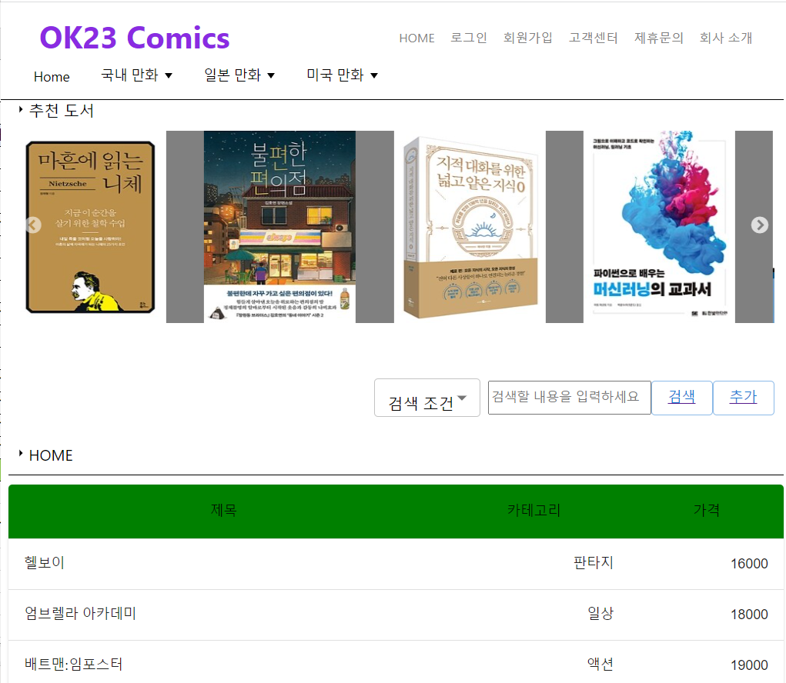
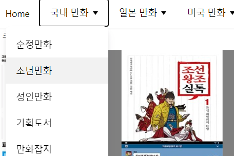
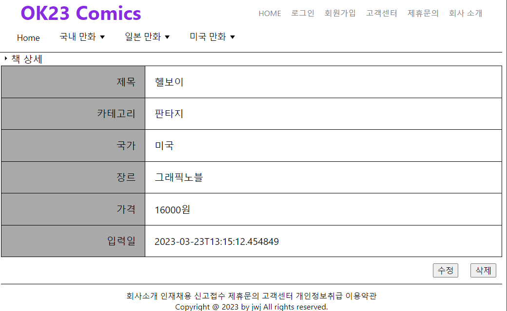
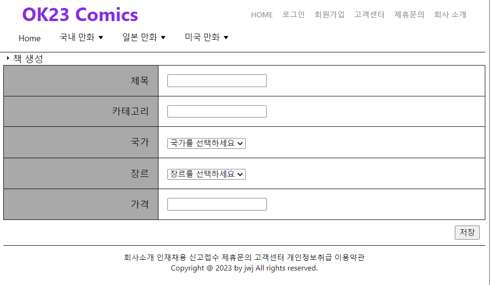

## 도서 쇼핑몰 클론 코딩
- 참고한 주소 https://www.sigongsa.com/comics/comicsMain.php
- ### 주요 목표
  - react, spring boot, jpa, mariaDB를 사용
  - 책 데이터 CRUD
  - 조건별 책 search
  - 요구사항에 따라 화면 구현

### 주요 기능
- 추천 도서 슬라이딩
- 검색
- 네비게이터
- 메뉴
- 책 CRUD
- 메인 페이지 반응형

## 구현 화면
- ### 메인 페이지

- 추천 도서는 react-slick를 사용하여 구현. 사진 파일은 static 사용
- 검색 기능
  - 조건(제목, 카테고리, 해당가격 이하)으로 검색 가능.
  - 현재 선택한 메뉴의 위치에 따라 검색하는 범위 제한
- 최근 추가 책 테이블
  - 최근에 추가한 책부터 상위에 표시하며 최대 5개 요소를 보여준다.

- ### 메뉴(네비게이터)

  
  - 객체 배열로 상위메뉴와 하위 메뉴를 선언하고 각 메뉴의 url을 저장해둔다.
  - 마우스 진입을 감지하여 하위 메뉴를 보여준다.
  - 클릭 시 해당하는 메뉴의 책들을 보여준다.

- ### 책 상세/삭제

- 책 id 정보를 가지고 서버에 요청하여 상세 정보를 표시한다.
- 삭제 버튼을 누르면 서버에 해당하는 책 삭제 요청을 보낸다.

- 책 수정/추가

- 기존 책을 수정인지 생성인지에 따라 정보가 입력되어 있거나 비어있다.
- 국가와 장르는 기본 값을 표시하여 국가 선택에 따라 장르 리스트가 변경된다.
 